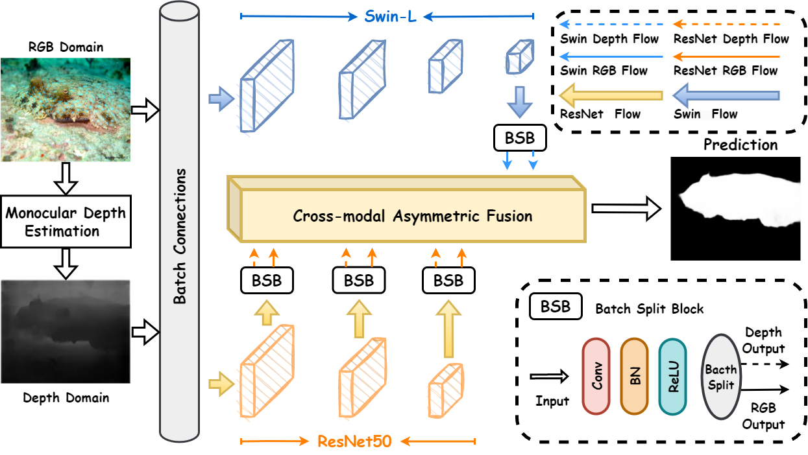

# DaCOD-Depth-aided-Camouflaged-Object-Detection
>**Authors:** [Qingwei Wang](https://qingwei-wang.github.io), [Jinyu Yang](https://github.com/yjybuaa), [Xiaosheng Yu](https://orcid.org/0000-0001-8427-8656), [Fangyi Wang](https://www.researchgate.net/profile/Fangyi-Wang-3), [Peng Chen](https://orcid.org/0000-0002-9002-5089), [Feng zheng](https://faculty.sustech.edu.cn/?tagid=fengzheng&iscss=1&snapid=1&orderby=date&go=1).

# Code is coming soon!!!

## Preface

##  🔥🔥🔥 This repository provides code for ["Depth-aided Camouflaged Object Detection"](https://dl.acm.org/doi/abs/10.1145/3581783.3611874) *ACM MM 2023*. 

      
    <em> 
    Figure 1: Examples of camouflaged objects, with groundtruth and depth maps generated by monocular depth estimation. Examples (a) to (c) show cases when camouflaged objects are salient in depth images, while examples (d) to (f) show cases when depth maps are not such helpful to COD.
    </em>

## Abstract

Camouflaged Object Detection (COD) aims to identify and segment objects that blend into their surroundings. Since the color and texture of the camouflaged objects are extremely similar to the surrounding environment, it is super challenging for vision models to precisely detect them. Inspired by research on biology and evolution, we introduce depth information as an additional cue to help break camouflage, which can provide spatial information and texture-free separation for foreground and background. To dig clues of camouflaged objects in both RGB and depth modalities, we innovatively propose Depth-aided Camouflaged Object Detection (DaCOD), which involves two key components. We firstly propose the Multi-modal Collaborative Learning (MCL) module, which aims to collaboratively learning deep features from both RGB and depth channels via a hybrid backbone. Then, we propose a novel Cross-modal Asymmetric Fusion (CAF) strategy, which asymmetrically fuse RGB and depth information for complementary depth feature enhancement to produce accurate predictions. We conducted numerous experiments of the proposed DaCOD on three widely-used challenging COD benchmark datasets, in which DaCOD outperforms the current state-of-the-arts by a large margin.

      
    <em> 
        Figure 2: Overall framework of the proposed DaCOD. RGB and depth images are firstly concatenated by batch connections, and then fed into two different backbones, ResNet and Swin transformer, for collaboratively learning. 
The collaboration features are separated by Batch Split Block (BSB), and then sent to Cross-modal Asymmetric Fusion (CAF) to produce the final prediction.
    </em>

## Results

You can download the results at [here](https://pan.baidu.com/s/1SvpsMy1vuImCGbouAHL7jg) (Code: h7vj)

## Citation
Please cite our paper if you find the work useful: 

          @inproceedings{10.1145/3581783.3611874,
          author = {Wang, Qingwei and Yang, Jinyu and Yu, Xiaosheng and Wang, Fangyi and Chen, Peng and Zheng, Feng},
          title = {Depth-Aided Camouflaged Object Detection},
          year = {2023},
          publisher = {Association for Computing Machinery},
          booktitle = {Proceedings of the 31st ACM International Conference on Multimedia},
          series = {MM '23}
          }

**[⏫ back to top](#DaCOD-Depth-aided-Camouflaged-Object-Detection)**
